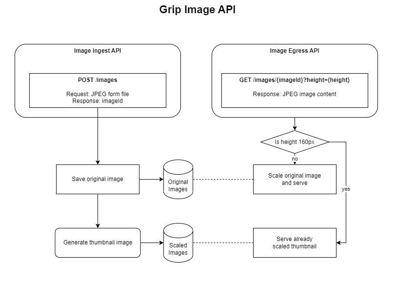

# GRIP Case Study: Images API
Images API can be accessed [here](https://gripcasestudyimagesapi.azurewebsites.net/swagger/index.html).

## Architecture overview

Solution consists of 2 REST APIs:
1. Image ingestion allows upload JPEG image and returns unique image identifier for later image access.

2. Image egress API returns specific image scaled to the given height as *image/jpeg* content type response.

## Implementation overview
API is implemented with C# and ASP.NET Core Web API.

Images are stored under *Azure Blob Storage* database. Both original image and scaled thumbnails are stored under same blob container for simplicity, but it could be kept under separate storage accounts to cope with higher load.

[SkiaSharp](https://github.com/mono/SkiaSharp) is used for image scaling which is cross-platform and free. Performance should be evaluated with other image processing libraries.

Thumbnail images are scaled down immediately on the upload API call, which could be offloaded to separate job. So *ImageUploaded* event would be introduced with Azure Function reacting to that, and scaling and saving the tumbnail(s). Small delay would be introduced, but computationaly-intense scaling operation would not affect APIs performance.

Implementation should be extended to support more image types than just JPEG, also have better image validation.

Also it should be considered to separate both Ingestion and Egress APIs to separate processes, to make sure one is not affecting another as loads may differ. This was not implemented for simplicity.

Tests should be improved to validate image resolutions.

Authentication & authorization should be configured.

## Deployment overview
### Current
At the moment API is deployed as *Azure App Service* on *Free (F1) Service Plan*. That is done via *GitHub Actions* for simplicity. All resources (*Storage, App Service, Plan*) were created manually on Azure.

### Suggested
Both *Ingestion* and *Egress* APIs should be built as *Docker images*.

They could be deployed either on AKS or [Azure Container Apps](https://learn.microsoft.com/en-us/azure/container-apps/environment) environment to ensure controlled auto-scaling.

API Gateway (e.g. [API Management](https://azure.microsoft.com/en-us/products/api-management/)) should be configured not to expose these APIs directly to the client, also control the rate limiting, authentication, URL routing, domain, etc.

All the mentioned Azure resources should be created in automated way via BICEP and executed as a *Release Pipeline* in *Azure DevOps* per each environment (e.g. *Dev*, *Stage*, *Production*).

All resources' connection strings should be automatically set on the AKS / Container Apps as environment variables, or even better - to KeyVault, and used by the services in runtime.

Considering this is not a single service, but more services to be deployed ahead, some shared BICEP modules should be created to automate Azure resources creation.
